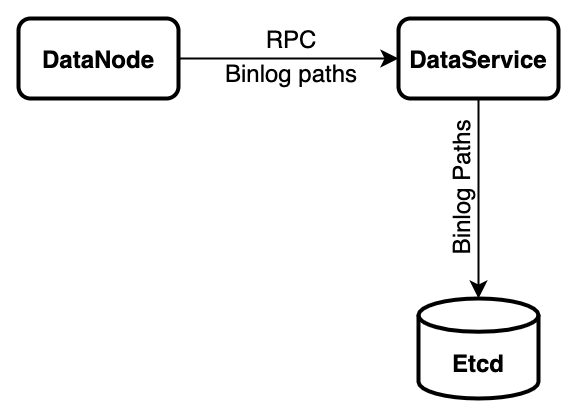

# DataNode Recovery Design

## Objectives

DataNode is stateless. It does whatever DataService tells, so recovery is not a difficult thing for datanode.
Once datanode subscribes certain vchannels, it starts working till crash. So the key to recovery is consuming
vchannels at the right position. What's processed no longer need to be processed again, what's not processed is
the key.

What's the line between processed or not for DataNode? Wether the data is flushed into persistent storage, which's
 the only job of DataNode. So recovering a DataNode needs the last positions of flushed data in every vchannels.
Luckily, this information will be told by DataService, DataNode only worries about updating positions after flushing.

There's more to fully recover a DataNode. DataNode replicates collection schema in memory to decode and encode
data. Once it recovers to an older position of insert channels, it needs the collection schema snapshots from
that exactly position. Luckily again, the snapshots will be provided via MasterService.

So DataNode needs to achieve the following 3 objectives.

### 1. Service Registration

DataNode registers itself to Etcd after grpc server started, in *INITIALIZING* state.

### 2. Service discovery

DataNode discovers DataService and MasterService, in *HEALTHY* state.

### 3. Recovery state

After stage 1&2, DataNode is healthy but IDLE. DataNode starts to work until the following happens.

- DataService info the vchannels and positions.

- DataNode replicates the snapshots of collection schema at the positions to which these vchannel belongs.

- DataNode initializes flowgraphs and subscribes to these vchannels

There're some problems I haven't thought of.

- What if DataService is unavaliable, by network failure, DataService crashing, etc.
- What if MasterService is unavaliable, by network failure, MasterService crashing, etc.
- What if MinIO is unavaliable, by network failure.

## TODO

### 1. DataNode no longer interacts with Etcd except service registering.

   **O1-1**. DataService rather than DataNode saves binlog paths into Etcd.
    
   
    
   **O1-2**. DataNode registers itself to Etcd when started.
    
### 2. DataNode gets start and end MsgPositions of all channels, and report to DataService after flushing.

   **O2-1**. Set start and end positions while publishing ddl messages.

   **O2-2**. [after **O4**]Get message positions in flowgraph and pass through nodes, report to DataService along with binlog paths. 

   **O2-3**. [with **O1-1**]DataNode is no longer aware of whether if segment flushed, so SegmentFlushed messages should be sent by DataService.

### 3. DataNode recovery

   **O3-1**. Flowgraph is initialized after DataService called WatchDmChannels, flowgraph is healthy if MasterService is available.

### 4. DataNode with collection with flowgraph with vchannel designs

#### The winner

#### The boring design

     

• If collection:flowgraph = 1 : 1, datanode must have ability to scale flowgraph.

•** [Winner]** If collection:flowgraph = 1 : n, datanode must have ability to scale flowgraph. Vchannel of collection is scalable.

• If collection:flowgraph = n : 1, in the blue cases, datanode must have ability to scale flowgraph. In the brown cases, flowgraph must be able to scale channels.

• If collection:flowgraph = n : n  , load balancing on vchannels.

