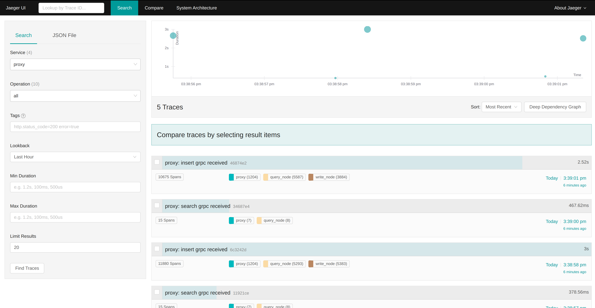
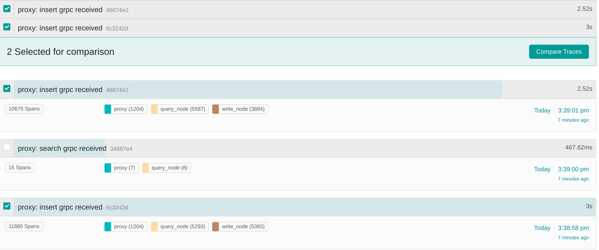
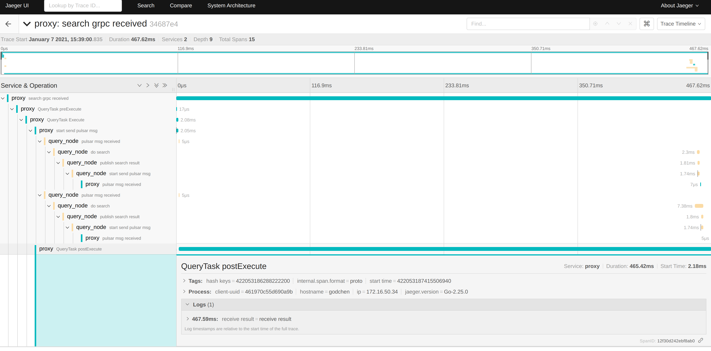

# Opentracing User Guide

This guide mainly describes the use of jaeger and the commonly used display meanings.

Jaeger, inspired by [Dapper](https://research.google.com/pubs/pub36356.html) and [OpenZipkin](https://zipkin.io/), is a distributed tracing platform created by [Uber Technologies](https://uber.github.io/) and donated to [Cloud Native Computing Foundation](https://cncf.io/). It can be used for monitoring microservices-based distributed systems:

- Distributed context propagation
- Distributed transaction monitoring
- Root cause analysis
- Service dependency analysis
- Performance / latency optimization

See also:

- Jaeger [documentation](https://jaegertracing.io/docs/) for getting started, operational details, and other information.
- Blog post [Evolving Distributed Tracing at Uber](https://eng.uber.com/distributed-tracing/).
- Tutorial / walkthrough [Take OpenTracing for a HotROD ride](https://medium.com/@YuriShkuro/take-opentracing-for-a-hotrod-ride-f6e3141f7941).

We mainly use jaeger as an implementation of opentracing.

Two requests: **Insert Request** and **Search Request** in milvus system are traced at this stage.

## Jaeger Home page

### Lookup by Trace ID

The use of the search box requires configuration of the log collection system. For example, if the log collection system collects an error log, find the Trace ID. Search in jaeger to quickly locate the error. So as to quickly solve the problem.

### Search

### Service

Filter with service name.

### Operation

Operation in Service, eg. request name, function name.

### Tags

Set tag to facilitate search. Tag is defined in code.

### Lookback

Filter with time.

### Min Duration & Max Duration

The minimum and maximum request duration, you can use this condition to find the time-consuming and short-term requests.

### Limit Result

The max number of results.

## Search result

You can search through the above conditions, and those that meet the conditions will appear in the right half.

The detailed information of search results.

1. The upper left corner identifies the service name: tracing, Root span name: Insert grpc received and The first half of the Trace ID 46874e2.
2. The duration of the entire request is shown in the upper right corner.
3. 10675 Span means that there are 10675 operations, see the number of operations for each service in the middle. And the trace time is shown in the right.
4. The user can select multiple traces with the box in the upper left, and then compare with them to find something different. For example, different insert request may take a different time. At this time, you can select two for comparison, and the comparison can be very easy to know which trace went wrong

## Detailed trace information

Click the search result. You can analyze the detail trace information.

1. Duration: Total time consume.
2. Service: The number of service called.
3. Depth: Call chain depth.
4. Total Spans: This call consists of 10 spans.
5. To enter the details, look at the left half first, showing the call chain of the entire request. The black represents the service name, and the gray kid represents the span name defined in the code.
6. The duration of the right half of the code call. The length represents the time consumed by the Span in the entire call chain.

### Span Detail information

Click the Span to see the detailed span information such as the last span in the picture above.

1. Tags contains a series of custom tags. You can mark in the code what type of call this Span is, request method, call result, call, etc. All the information it contains can be filtered by the Tags on the homepage.
2. Process can locate which specific server processing this data.
3. Logs are the logs printed by this span during the call.

## More

More usage guides will be updated in the future.
